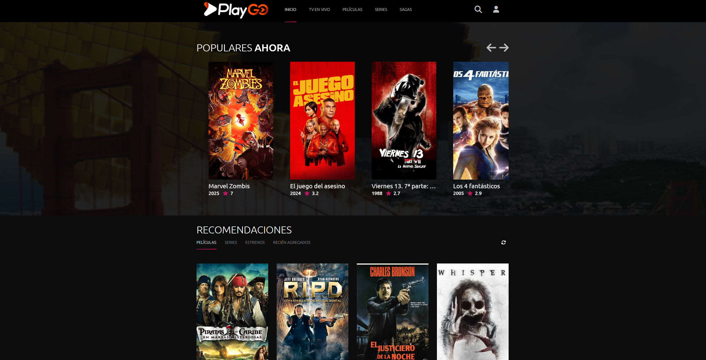
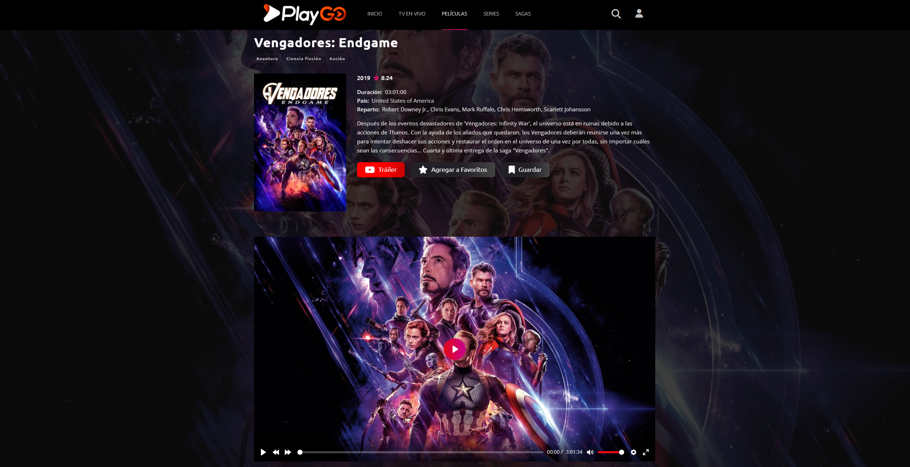

# PLAYGO - Web IPTV Player

[](https://php.net/)
[](https://developer.mozilla.org/en-US/docs/Web/JavaScript)
[](https://getbootstrap.com/)
[](https://jquery.com/)
[](https://httpd.apache.org/)
[](https://creativecommons.org/licenses/by-nc/4.0/)
[](#)
[](https://github.com/Jeremias0618/PLAYGO-Web-IPTV-Player)

**PLAYGO** is a production-ready, modular web-based IPTV player that connects to Xtream UI-compatible IPTV services. Built with a clean MVC architecture, it provides a comprehensive streaming platform with advanced features including user profiles, custom playlists, saga management, and real-time progress tracking. The system uses JSON-based storage for scalability and performance, eliminating the need for traditional databases.

> ⚠️ **IMPORTANT NOTICE**: This PHP version is an **outdated legacy version** of the PLAYGO project. The current active version has been migrated to **React.js** and **Node.js** with **PostgreSQL** database, featuring a completely redesigned architecture and enhanced functionality. This PHP repository is maintained for historical reference and legacy deployments only.






---

## 🏗️ Architecture Overview

PLAYGO follows a **Model-View-Controller (MVC)** architecture pattern with clear separation of concerns:

- **Controllers** (`libs/controllers/`): Handle HTTP requests, orchestrate business logic, and prepare data for views
- **Services** (`libs/services/`): Contain core business logic, API integrations, and data processing
- **Endpoints** (`libs/endpoints/`): RESTful API endpoints for AJAX requests and data operations
- **Views**: PHP templates that render the user interface
- **Storage**: JSON-based file system for user data, playlists, history, and configuration

---

## 🚀 Core Features

### Streaming & Content Management
- **Live TV Streaming**: Real-time channel streaming with EPG support
- **VOD Library**: Complete movie and series catalog with metadata
- **Series Management**: Multi-season series with episode tracking
- **Content Search**: Full-text search across all content types
- **Content Recommendations**: AI-powered recommendations based on viewing history

### User Management & Personalization
- **User Profiles**: Comprehensive user profiles with statistics and account information
- **Authentication System**: Secure login with Xtream UI credential validation
- **Session Management**: Cookie-based session handling with expiration tracking
- **User Data Storage**: Per-user JSON storage for isolation and scalability
- **Progress Tracking**: Real-time viewing progress with resume functionality
- **Watch History**: Complete viewing history with date tracking and filtering

### Content Organization
- **Custom Playlists**: User-created playlists with drag-and-drop reordering
- **Saga Management**: Create and manage custom movie/series sagas
- **Favorites System**: Quick access to favorite content
- **Content Collections**: Pre-defined collections and curated content

### Technical Features
- **Parallel API Processing**: `curl_multi` for concurrent Xtream UI API calls
- **Response Caching**: Intelligent caching of API responses and metadata
- **Image Optimization**: Lazy loading, WebP support, and fallback mechanisms
- **Responsive Design**: Mobile-first design with Android optimization
- **Performance Monitoring**: Built-in performance tracking and optimization

---

## 📁 Project Structure

```
PLAYGO/
├── index.php                      # Application entry point
├── login.php                      # Authentication interface
├── home.php                       # Dashboard/homepage
├── profile.php                    # User profile management
├── playlist.php                   # Playlist viewer
├── collection.php                 # Saga/collection viewer
├── sagas.php                      # Saga listing
├── sagas_admin.php                # Saga administration panel
│
├── channels.php / channel.php     # Live TV channels
├── movies.php / movie.php          # Movie catalog
├── series.php / serie.php         # Series catalog
├── episode.php                    # Episode player
│
├── libs/                          # Core application logic
│   ├── controllers/               # MVC Controllers
│   │   ├── Authentication.php    # Login/logout handling
│   │   ├── Profile.php           # User profile data
│   │   ├── Collection.php        # Saga/collection rendering
│   │   ├── Movie.php             # Movie detail controller
│   │   ├── SeriePageController.php # Series detail controller
│   │   ├── EpisodePageController.php # Episode controller
│   │   ├── Search.php            # Search functionality
│   │   └── SagasAdminController.php # Saga admin operations
│   │
│   ├── services/                  # Business logic layer
│   │   ├── auth.php              # Authentication service
│   │   ├── XtreamApi.php         # Xtream UI API client
│   │   ├── collection.php        # Collection processing
│   │   ├── movies.php            # Movie data processing
│   │   ├── series.php            # Series data processing
│   │   ├── series-episodes.php   # Episode management
│   │   ├── live.php              # Live TV processing
│   │   └── content.php           # Content aggregation
│   │
│   ├── endpoints/                 # REST API endpoints
│   │   ├── UserData.php          # User data operations
│   │   ├── SagasAdmin.php        # Saga CRUD operations
│   │   ├── XtreamApi.php         # Xtream API proxy
│   │   ├── ApiContent.php        # Content API
│   │   └── MovieRecommended.php  # Recommendations API
│   │
│   ├── config.php                 # Application configuration
│   ├── config.example.php        # Configuration template
│   ├── lib.php                    # Utility functions
│   └── connection.php             # Database abstraction (future)
│
├── storage/                       # JSON-based data storage
│   ├── sagas.json                 # Saga definitions
│   ├── users/                     # Per-user data
│   │   └── [username]/
│   │       ├── user_data.json     # User session history
│   │       ├── playlists.json     # User playlists
│   │       ├── favorites.json     # Favorite content
│   │       ├── history.json       # Viewing history
│   │       └── progress.json      # Viewing progress
│
├── assets/                        # Static assets
│   ├── icon/                      # Icon files (SVG, PNG)
│   ├── image/                     # Images (wallpapers, screenshots)
│   └── logo/                      # Branding assets
│
├── styles/                        # CSS stylesheets (organized by page)
│   ├── profile/                   # Profile page styles
│   │   ├── layout.css            # Desktop layout
│   │   └── mobile.css            # Mobile/Android optimization
│   ├── collection/                # Collection page styles
│   ├── movie/                     # Movie page styles
│   ├── serie/                     # Series page styles
│   ├── playlist/                  # Playlist page styles
│   └── [page]/                    # Page-specific styles
│
├── scripts/                       # JavaScript modules
│   ├── profile/                   # Profile page scripts
│   │   └── init.js               # Carousel initialization
│   ├── collection/                # Collection page scripts
│   ├── movie/                     # Movie page scripts
│   ├── serie/                     # Series page scripts
│   └── [page]/                    # Page-specific scripts
│
├── vendor/                        # Third-party dependencies
│   └── phpmailer/                 # PHPMailer library
│
└── tmdb_cache/                    # TMDB metadata cache
```

---

## 🛠️ Technical Requirements

### Server Requirements
- **Web Server**: Apache 2.4+ or Nginx 1.18+
- **PHP**: 7.4 or higher (PHP 8.0+ recommended)
- **PHP Extensions**:
  - `curl` - For API communication
  - `json` - For JSON data processing
  - `mbstring` - For string manipulation
  - `openssl` - For secure connections
  - `fileinfo` - For file type detection
  - `gd` or `imagick` - For image processing (optional)

### System Requirements
- **Storage**: Minimum 100MB free space (for cache and user data)
- **Memory**: PHP memory_limit ≥ 128MB recommended
- **Permissions**: Write access required for:
  - `storage/` directory and subdirectories
  - `tmdb_cache/` directory

### External Services
- **Xtream UI**: Compatible IPTV service with API access
- **TMDB API** (Optional): For enhanced metadata and artwork
- **SMTP Server** (Optional): For email notifications

---

## ⚙️ Configuration

### Initial Setup

1. **Clone the repository**:
   ```bash
   git clone https://github.com/Jeremias0618/PLAYGO-Web-IPTV-Player.git
   cd PLAYGO-Web-IPTV-Player
   ```

2. **Configure the application**:
   ```bash
   cp libs/config.example.php libs/config.php
   nano libs/config.php
   ```

3. **Set required configuration**:
   ```php
   define('IP', 'URL_SERVER'); // IP or URL of the Xtream Codes server
   define('TMDB_API_KEY', 'API_KEY_TMDB'); // TMDB API key
   define('LANGUAGE', 'LANGUAGE_DEFAULT'); // Default language for movie and series descriptions
   define('NOME_IPTV', 'PLAYGO'); // IPTV service name
   ```

4. **Set directory permissions**:
   ```bash
   chmod -R 755 storage/
   chmod -R 755 tmdb_cache/
   ```

5. **Configure web server** (Apache example):
   - Enable `mod_rewrite`
   - Set `DocumentRoot` to project directory
   - Configure virtual host (see `.htaccess.example`)

### Configuration Options

| Option | Description | Required |
|--------|-------------|----------|
| `IP` | IP or URL of the Xtream Codes server | Yes |
| `TMDB_API_KEY` | TMDB API key for metadata | Yes |
| `LANGUAGE` | Default language (es-ES, es-MX, en-US, etc.) | Yes |
| `NOME_IPTV` | IPTV service name | Yes |
| `SMTP_*` | SMTP configuration for emails | No |

---

## 🔧 API Integration

### Xtream UI API

PLAYGO integrates with Xtream UI API for content delivery:

```php
// Example: Fetching movie information
$api = new XtreamApiService();
$movieInfo = $api->getVodInfo($movieId);
```

**Supported Endpoints**:
- `get_live_categories` - Live TV categories
- `get_live_streams` - Live TV streams
- `get_vod_categories` - VOD categories
- `get_vod_info` - Movie information
- `get_series_categories` - Series categories
- `get_series_info` - Series information
- `get_series_episodes` - Episode listing
- `get_account_info` - User account details

### Internal API Endpoints

PLAYGO provides RESTful endpoints for frontend operations:

- `POST /libs/endpoints/UserData.php` - User data operations
  - `action=playlist_create` - Create playlist
  - `action=playlist_delete` - Delete playlist
  - `action=playlist_add` - Add item to playlist
  - `action=playlist_remove` - Remove item from playlist
  - `action=favorite_add` - Add to favorites
  - `action=favorite_remove` - Remove from favorites
  - `action=history_add` - Add to history
  - `action=progress_update` - Update viewing progress

- `POST /libs/endpoints/SagasAdmin.php` - Saga management
  - `action=create` - Create new saga
  - `action=update` - Update existing saga
  - `action=delete` - Delete saga
  - `action=list` - List all sagas

---


## 🧪 Development

### Code Style Guidelines

- **PHP**: PSR-12 coding standard
- **JavaScript**: ES6+ with jQuery compatibility
- **CSS**: BEM-like naming convention
- **File Naming**: kebab-case for files, PascalCase for classes

### Testing

```bash
# Test API connectivity
php -r "require 'libs/services/XtreamApi.php'; ..."

# Validate JSON structure
php -r "json_decode(file_get_contents('storage/sagas.json'));"
```

### Debugging

Enable error reporting in development:
```php
// In libs/config.php
error_reporting(E_ALL);
ini_set('display_errors', 1);
```

---

## 📖 Usage Examples

### Creating a Custom Saga

```php
// Via admin panel: sagas_admin.php
// Or programmatically:
$sagaData = [
    'id' => 1,
    'title' => 'Marvel Cinematic Universe',
    'image' => 'path/to/image.jpg',
    'items' => [
        ['id' => '123', 'type' => 'movie', 'name' => 'Iron Man', 'order' => 1],
        // ...
    ]
];
```

### Adding to Playlist via API

```javascript
fetch('libs/endpoints/UserData.php', {
    method: 'POST',
    headers: {'Content-Type': 'application/x-www-form-urlencoded'},
    body: 'action=playlist_add&playlist_name=My%20List&item_id=123&item_type=movie'
});
```

---

## 🤝 Contributing

1. Fork the repository
2. Create a feature branch (`git checkout -b feature/amazing-feature`)
3. Commit your changes (`git commit -m 'Add amazing feature'`)
4. Push to the branch (`git push origin feature/amazing-feature`)
5. Open a Pull Request

### Contribution Guidelines
- Follow existing code style and architecture patterns
- Add comments for complex logic
- Update documentation for new features
- Test on multiple devices and browsers
- Ensure backward compatibility

---

## 📄 License

This project is licensed under the **Creative Commons Attribution-NonCommercial (CC BY-NC 4.0)** license.

See the [LICENSE](LICENSE) file for details.

**Commercial Use**: For commercial licensing, please contact the project maintainers.

---

## 🙏 Disclaimer

PLAYGO does not host, store, or provide any IPTV content. It is a tool for connecting to legally obtained IPTV services. Users are solely responsible for ensuring they have proper licensing and authorization to access the content they stream through this application.

The developers and contributors of PLAYGO are not responsible for:
- Content accessed through the application
- Legal issues arising from content access
- Service availability or quality from IPTV providers
- Any misuse of the application

---

## 📬 Support & Contact

- **Issues**: [GitHub Issues](https://github.com/Jeremias0618/PLAYGO-Web-IPTV-Player/issues)
- **Pull Requests**: [GitHub Pull Requests](https://github.com/Jeremias0618/PLAYGO-Web-IPTV-Player/pulls)
- **Documentation**: See inline code comments and this README

---

## ⚠️ Project Status & Migration Notice

**This PHP version is deprecated and no longer actively maintained.**

The PLAYGO project has been **fully migrated** to a modern technology stack:

- **Frontend**: React.js with modern UI/UX design
- **Backend**: Node.js with Express.js framework
- **Database**: PostgreSQL for robust data management
- 
- **Architecture**: RESTful API with microservices architecture

The current active version features:
- Complete redesign with improved user experience
- Enhanced performance and scalability
- Advanced features and functionality
- Better security and maintainability
- Modern development workflow

**This PHP repository is maintained for:**
- Historical reference
- Legacy deployments still in use
- Educational purposes

For the latest version and active development, please refer to the React.js/Node.js repository.

---

**Desarrollado por el equipo de CYBERCODE LABS**
